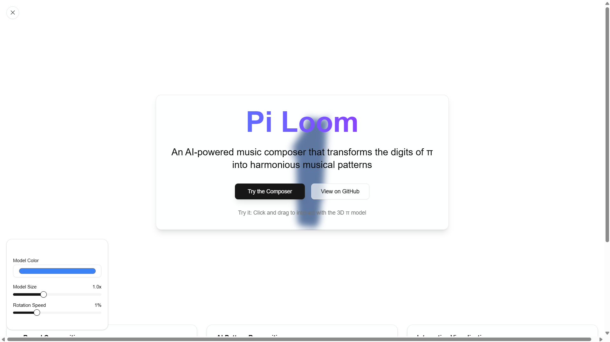
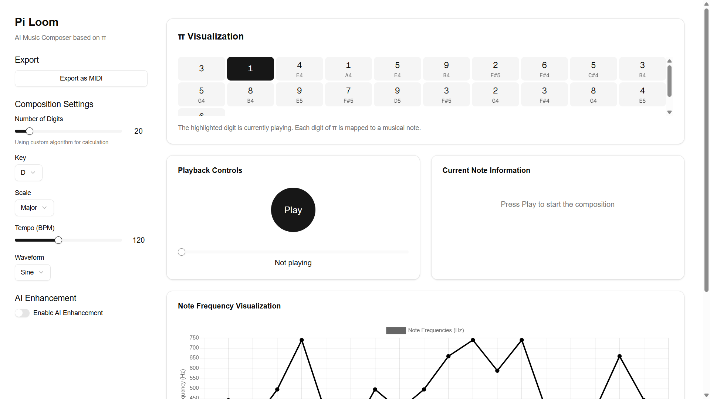

# Pi Loom - AI Music Composer

Pi Loom is an AI-powered music composer that transforms the digits of π into harmonious musical patterns. This project was created for the π-Day AI Hackathon 2025.




## Features

- **π-Based Composition**: Converts π's digits into musical notes based on scales and keys
- **AI Pattern Recognition**: Detects and highlights patterns within π's sequence
- **Harmony Generation**: Creates complementary harmonies based on the main melody
- **Interactive Visualization**: Visualizes the note frequencies and detected patterns
- **Customizable Parameters**: Adjust tempo, key, scale, and AI enhancement settings
- **3D Visualization**: Interactive 3D representation of π on the landing page

## How It Works

1. **Digit to Note Conversion**: Each digit of π is mapped to a note in the selected musical scale
2. **Pattern Detection**: The AI analyzes the sequence to find repeating patterns
3. **Melody Enhancement**: Based on detected patterns, the AI can enhance the melody
4. **Harmony Generation**: Optional harmonies can be generated to complement the main melody
5. **Interactive Playback**: Users can play the composition with various waveforms and tempos

## Technical Implementation

Pi Loom uses several technologies:

- **Next.js**: React framework for the user interface
- **Web Audio API**: For generating and playing musical notes
- **Chart.js**: For visualizing note frequencies
- **AI Pattern Recognition**: Custom algorithm to detect patterns in π's digits
- **Framer Motion**: For smooth animations
- **Three.js**: For 3D visualization of π on the landing page

## Getting Started

First, run the development server:

```bash
npm run dev
# or
yarn dev
# or
pnpm dev
# or
bun dev
```

Open [http://localhost:3000](http://localhost:3000) with your browser to see the result.

## Usage

1. Adjust the composition settings (number of digits, key, scale, tempo)
2. Enable AI enhancement if desired
3. Click the Play button to hear the π-based composition
4. Experiment with different waveforms and harmony options
5. Observe the patterns detected by the AI
